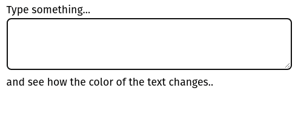
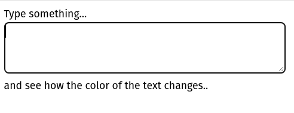
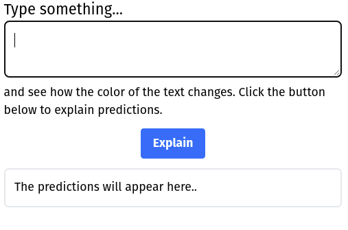

# Frontend for Shap Emotions Correction

This demo detects sentiment: positive (green), neutral (black) /negative (red) 



the predictions update as you type



## Explaining sentiment

You can also explain the predictions



Scores are presented on scale from blue to red. 
Red means that this word increased probability of this output class.
Blue on the other hand decreased it.
White words are neutral for this output.

## How to run
1. Run sentiment API:
``` commandline
docker run -p 8000:8000 finloop/shap-emotions-correction-api:latest
```
1. Intall npm dependencies:
``` commandline
npm install
```

3. Run server:

``` commandline
npx parcel src/index.html
```